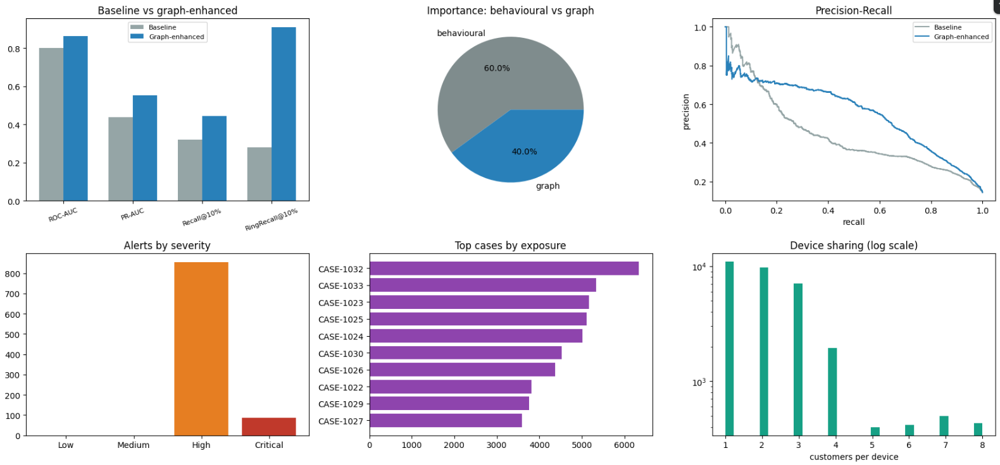

# Financial Transaction Intelligence Platform

An end-to-end financial transaction intelligence and fraud investigation platform combining **behavioral machine learning, graph-based risk analysis, alert prioritization, case consolidation, and evidence-grounded investigation**.

The project investigates a central question:

> **Can transaction-network structure identify coordinated fraud that conventional behavioral features cannot see?**


---

## Overview

Traditional fraud detection evaluates transactions primarily as individual events. Coordinated fraud can evade this approach when individual transactions appear normal, while multiple customers are connected through shared devices or merchants.

This platform adds an **entity-graph intelligence layer** to transaction-level fraud detection, connecting:

- Customers
- Devices
- Merchants
- Transactions

The system combines these relationships with behavioral and historical transaction features to generate fraud-risk scores, identify coordinated fraud rings, prioritize alerts, and consolidate related alerts into investigation cases.

---

## Key Results

| Metric | Result |
|---|---:|
| Transactions processed | **31,449** |
| Graph nodes | **972** |
| Graph edges | **17,765** |
| Fraud alerts generated | **944** |
| Investigation cases | **34** |
| Seeded fraud rings recovered | **12 / 12** |
| Alert precision | **64.8%** |
| Baseline ROC-AUC | **0.8010** |
| Graph-enhanced ROC-AUC | **0.8618** |
| Baseline PR-AUC | **0.4369** |
| Graph-enhanced PR-AUC | **0.5512** |
| Baseline Ring Recall @ 10% | **0.2808** |
| Graph Ring Recall @ 10% | **0.9093** |

The graph-enhanced model improved:

- **ROC-AUC:** 0.8010 → 0.8618
- **PR-AUC:** 0.4369 → 0.5512
- **Recall @ Top 10%:** 0.3206 → 0.4429
- **Ring Recall @ Top 10%:** 0.2808 → 0.9093

The baseline and graph-enhanced models use the **same Random Forest architecture, temporal split, and training rows**. The primary experimental change is the addition of graph-derived features.



---

## Architecture

```text
Transactions ─▶ Behavioural Features ─┐
      │                                │
      ▼                                ├─▶ Fraud Model ─▶ ML Risk ─┐
Entity Graph ─▶ Graph Features ────────┘                           │
      │                                                            │
      ├──────────────────────▶ Network Risk ──────────────────────┤
      │                                                            ▼
      │                                                   Alert Scoring
      │                                                            │
      └──────────────────────▶ Ring Detection              Alert Prioritisation
                                                                    │
                                                                    ▼
                                                             Case Management
                                                                    │
                                                         Evidence Pack
                                                          (deterministic)
                                                                    │
                                                             LLM Narration
                                                                    │
                                                                    ▼
                                                                 Analyst
