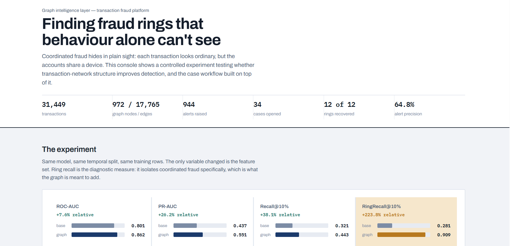

# Financial Transaction Intelligence Platform

An end-to-end fraud investigation platform combining **transaction-level machine learning with graph intelligence** to detect coordinated fraud, prioritize alerts, and support evidence-grounded investigations.



## Overview

The platform extends conventional transaction-level fraud detection with a **customer–device–merchant graph layer**, capturing relationship signals that individual transaction features cannot represent.

```text
Transactions
     ↓
ETL & Data Quality
     ↓
Feature Engineering
     ↓
Fraud Model + Graph Intelligence
     ↓
Risk & Alert Scoring
     ↓
Case Consolidation
     ↓
Evidence-Based Investigation
     ↓
LLM Narration
