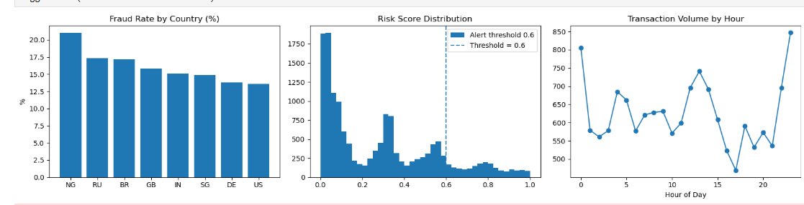
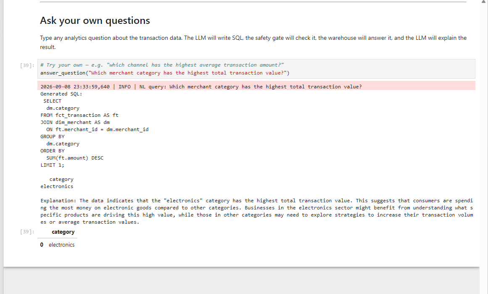

# Financial Transaction Risk & Intelligence Platform

An end-to-end financial data pipeline combining SQL-based warehousing, machine learning fraud-risk scoring, and Gemini-powered natural-language analytics.

## Key Results

- Processed **15,000 transactions** across 200 customers and 40 merchants.
- Engineered **9 fraud-risk features** for transaction-level risk assessment.
- Achieved **0.821 ROC-AUC** using a Random Forest classifier.
- Generated **2,093 high-risk alerts**.
- Enabled natural-language analytics through read-only SQL validation.

## Architecture

```text
Synthetic Data → Raw Zone → Validation → SQLite Warehouse
                                           |
                                    Star Schema
                                           |
                                   Feature Engineering
                                           |
                                    Random Forest
                                           |
                                     Risk Alerts

Natural Language → Gemini → SQL Validation → SQLite
                                           |
                                   Results & Explanation
```

## Tech Stack

Python · Pandas · NumPy · SQL · SQLite · scikit-learn · Google Gemini · Matplotlib

## Core Components

- **ETL & Data Quality:** CSV ingestion, validation checks, and structured SQL transformations.
- **Dimensional Modeling:** Star schema with customer, merchant, date, and transaction fact tables.
- **Fraud Detection:** Nine engineered features and a Random Forest classifier for transaction-risk scoring.
- **Natural-Language Analytics:** Gemini generates SQL from plain-English questions; validated queries execute against the SQLite warehouse.
- **Monitoring & Visualization:** Pipeline logging, risk-score distributions, fraud-rate analysis, and transaction-volume charts.

## Visualizations



The dashboard summarizes fraud rates across countries, the distribution of transaction risk scores, and hourly transaction volumes.

## Natural-Language Analytics



Users can ask questions in plain English, such as:

- Which merchant categories have the highest fraud rates?
- What is the total transaction value by country?
- How many high-risk alerts involve new accounts and foreign transactions?

Gemini generates SQL, a safety check validates the query, SQLite executes it, and Gemini explains the returned results.

## Limitations

The dataset and fraud labels are synthetic. Model metrics demonstrate performance on generated data, not validated real-world fraud detection. Gemini analytics requires API access, and the SQL safety checks are intended for demonstration rather than production deployment.

## Project Details

- **Domain:** Financial Analytics, Data Engineering, Fraud Detection
- **Period:** August 2026 – September 2026
